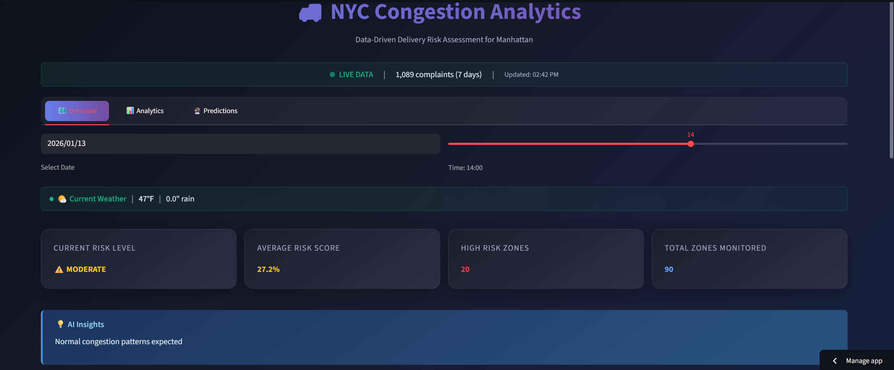
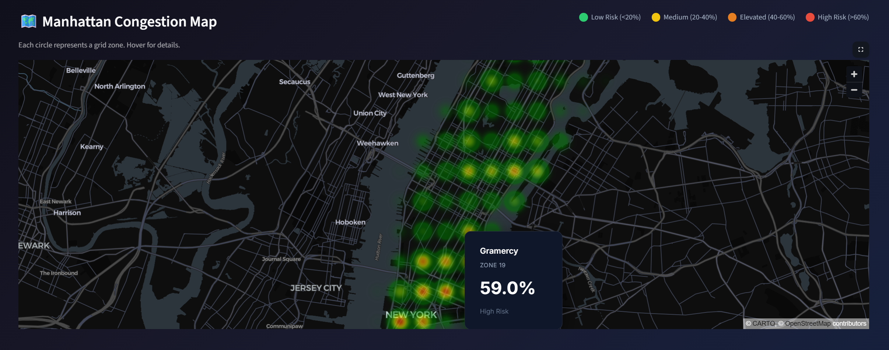
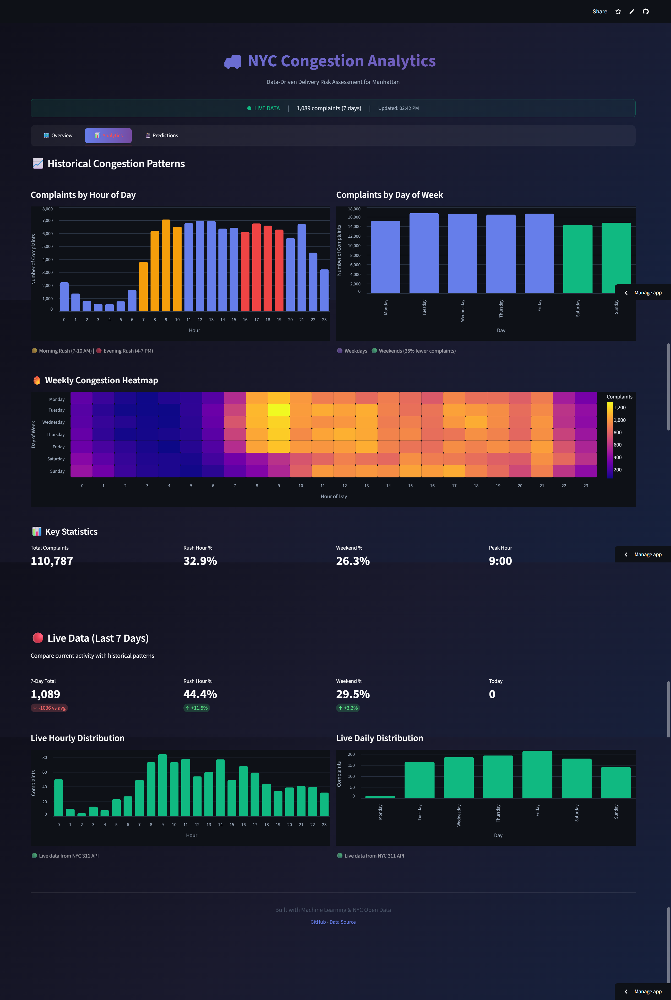

<p align="center">
  <h1 align="center">🚚 NYC Curbside Congestion Predictor</h1>
  <p align="center">
    <strong>Data-driven prediction of delivery truck congestion patterns across Manhattan</strong>
  </p>
  <p align="center">
    <a href="https://nyc-curbside-congestion.streamlit.app"></a>
  </p>
  <p align="center">
    
    
    
    
  </p>
</p>

---

## 📋 Overview

This project analyzes **NYC 311 complaint data** to predict where and when delivery truck congestion is most likely to occur across Manhattan. The interactive dashboard allows logistics planners, city officials, and researchers to explore congestion risk under different conditions.

### ✨ Key Features

- 🗺️ **Interactive Heatmap** — Visualize congestion risk across Manhattan with smooth gradient visualization
- 🌦️ **Live Weather Integration** — Automatically fetches current and 7-day forecast weather data
- 📅 **Holiday Awareness** — Factors in US holidays and special days for improved predictions
- 🚛 **Multi-Zone Scheduler** — Plan deliveries across multiple neighborhoods with optimized timing
- ⏰ **24-Hour Forecasting** — See congestion risk for the entire day ahead
- 📊 **Real-Time 311 Data** — Pulls live complaint data from NYC Open Data API

---

## 🖼️ Screenshots

### Dashboard Overview


### Congestion Heatmap
Interactive heatmap showing real-time congestion risk across Manhattan neighborhoods.



### Predictions & Scheduler
24-hour forecast with Multi-Zone Delivery Scheduler for optimized route planning.


### Analytics Dashboard
Historical congestion patterns by hour and day of week.



---

## 🏗️ Project Structure

```
nyc-curbside-congestion/
├── app/
│   └── app.py                 # Streamlit dashboard
├── data/
│   ├── modeling_dataset.csv   # Aggregated training data
│   ├── complaints_with_features.csv
│   └── nyc_weather_2023_present.csv
├── models/
│   └── xgboost_model.pkl      # Trained XGBoost classifier
├── notebooks/
│   ├── 01_EDA_and_Preprocessing.ipynb
│   └── 02_Modeling_and_Evaluation.ipynb
├── scripts/
│   ├── train_xgboost.py       # Model training script
│   ├── train_enhanced_model.py # Enhanced model with holidays
│   └── fetch_weather_data.py  # Weather API integration
├── src/
│   ├── __init__.py
│   ├── config.py              # Centralized configuration
│   ├── utils.py               # Shared utility functions
│   ├── api_311.py             # NYC 311 API client
│   └── holidays.py            # Holiday detection module
├── requirements.txt
├── LICENSE
└── README.md
```

---

## 🚀 Getting Started

### Prerequisites

- Python 3.9 or higher
- pip package manager

### Installation

1. **Clone the repository**
   ```bash
   git clone https://github.com/Karan-C21/nyc-curbside-congestion.git
   cd nyc-curbside-congestion
   ```

2. **Create a virtual environment** (recommended)
   ```bash
   python -m venv venv
   
   # Windows
   venv\Scripts\activate
   
   # macOS/Linux
   source venv/bin/activate
   ```

3. **Install dependencies**
   ```bash
   pip install -r requirements.txt
   ```

4. **Run the dashboard**
   ```bash
   streamlit run app/app.py
   ```

The dashboard will open in your browser at `http://localhost:8501`

---

## 🧠 Model Performance

The XGBoost classifier uses 16 features including temporal, spatial, weather, and holiday features:

### Features Used
- **Temporal**: hour, day_of_week, is_weekend, is_rush_hour, month
- **Spatial**: grid_lat, grid_lon
- **Weather**: avg_temp, avg_precip, pct_rainy, pct_cold, pct_hot
- **Holiday**: is_holiday, is_holiday_week, is_month_end, is_month_start

### Performance Metrics

| Metric | Score |
|--------|-------|
| **Accuracy** | 84.3% |
| **Precision** | ~62% |
| **Recall** | ~89% |
| **F1 Score** | ~73% |

---

## 🛠️ Tech Stack

| Category | Technologies |
|----------|-------------|
| **Language** | Python 3.9+ |
| **ML Framework** | XGBoost, scikit-learn |
| **Dashboard** | Streamlit, PyDeck |
| **Data Processing** | Pandas, NumPy |
| **Visualization** | Altair, Matplotlib |
| **APIs** | NYC Open Data, Open-Meteo Weather |

---

## 📁 Data Sources

- **NYC 311 Complaints**: [NYC Open Data Portal](https://data.cityofnewyork.us/Social-Services/311-Service-Requests-from-2010-to-Present/erm2-nwe9)
- **Weather Data**: [Open-Meteo API](https://open-meteo.com/)
- **Holiday Data**: Built-in US federal holiday detection

---

## 🔮 Future Improvements

- [x] ~~Deploy to Streamlit Cloud for public access~~ ✅ [Live Demo](https://nyc-curbside-congestion.streamlit.app)
- [ ] Add historical trend analysis
- [ ] Incorporate traffic camera data
- [ ] Add time-series forecasting (LSTM/Prophet)
- [ ] Expand to all NYC boroughs
- [ ] Add route optimization between zones

---

## 📄 License

This project is licensed under the MIT License - see the [LICENSE](LICENSE) file for details.

---

<p align="center">
  <sub>Built with ❤️ using NYC Open Data</sub>
</p>
